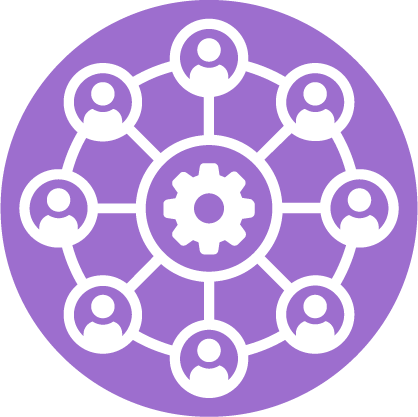

 

  <h1 align="center">Decentralized Autonomous Organization</h1>

  

     
    <a href=""><strong>Contracts on the blockchain</strong></a>
     
     
    <a href="./assets/pdf/Progetto Smart Contract con Solidity Advanced di Samuele Furnari.pdf">Presentation IT</a>
  

## Introduction

This repository contains the implementation of a Decentralized Autonomous Organization (DAO) using Hardhat. Further details on the functionality and purpose of the DAO can be found throughout this documentation.

## About my choices

In this project, I've implemented four Solidity contracts to facilitate the functioning of the DAO:

1. **GovernanceToken.sol**: This contract serves as the heart of the DAO, allowing the acquisition of governance tokens critical for participation in the organization's decision-making processes. Users have the option to acquire a minimum of 1 to 5 governance tokens, which can subsequently be used to propose (5 GT per proposal) or vote (1 GT per vote) on various proposals within the DAO. The owner of this contract retains the power to determine when the token sale is concluded and at the same time initializes the ability to create proposals. Once the token sale ends, all functions related to token acquisition will be disabled until the start of the next token sale cycle. This mechanism ensures that the DAO's governance processes are conducted in a structured and controlled manner.
2. **Proposal.sol**: Upon the conclusion of the token sale, the focus shifts to this contract, which facilitates the creation and management of proposals within the DAO. Users are empowered to submit proposals at a cost of 5 governance tokens. These proposals are subsequently made available for voting by the DAO's community members. Additionally, this contract implements a function to retrieve proposals by their unique identifiers, enabling efficient proposal management and reference within the DAO. It's important to note that when a user submits a proposal their account will be automatically marked as "voted: true", indicating they have already participated in the decision-making process. This approach has been adopted to prevent the blocking of the vote closing function (closeVote), which requires participation from all members to proceed with the next voting cycle. The automatic assignment of "voted" status enables a smooth and uninterrupted flow of voting activities within the DAO. Similar to the previous contract, once the proposal submission phase is closed, no further proposals can be created until the contract is reactivated for the next proposal cycle. This ensures that the DAO's governance process maintains integrity and follows a structured workflow.
3. **Vote.sol**: Following the closure of the proposal submission phase, the DAO proceeds to the voting stage where token holders exercise their voting rights on proposed initiatives. This contract facilitates the voting process by allowing token holders to cast their votes for or against specific proposals, identified by their unique IDs. An important aspect to note is the mandatory participation of all community members in the voting process. Upon becoming a DAO member by acquiring at least 1 governance token, members are obligated to cast their votes within a specified timeframe (1 week from the closeProposal call). In the voting section, users have the freedom to choose whether to participate or abstain from the decision-making process. Those who wish to abstain from voting can do so without risking the loss of purchased tokens. However, it's important to emphasize that abstention from voting is not automatic. Users who wish to abstain must explicitly call the abstention function. This mechanism has been implemented to ensure that the decision-making process is not blocked due to inactive members. In case of non-participation within the one-week deadline (from the closeProposal call), tokens will be removed from the user's account to ensure the continuation of the voting cycle and maintain a high level of engagement within the DAO. This mechanism ensures active engagement and participation from all DAO members, fostering a culture of democratic decision-making and accountability within the organization.
4. **Execute.sol**: After the conclusion of the voting period, the DAO enters the final phase where the results of the proposals are determined and executed. In this final phase, it is mandatory to execute all created proposals to finalize the "cycle" of decision-making within the DAO, in fact the sale of tokens (and everything that comes with it) will not be able to reopen if all the proposals are not executed. All members have the authority to execute proposals by providing the proposal ID and verifying whether it has been approved or rejected based on the voting outcomes. This inclusive approach ensures that every proposal undergoes the necessary execution process, contributing to the effective governance and operations of the DAO.

These contracts collectively form the backbone of the DAO, enabling decentralized decision-making and governance among its participants.

## Installation

To install and run this project locally, follow these steps:

1. Clone this repository: `git clone https://github.com/samuelefrni/DAO`
2. Navigate to the project directory
3. Install dependencies: `npm install`
4. Compile contracts: `npx hardhat compile`
5. Run tests: `npx hardhat test`

### Important

***Before running the "npx hardhat test"***

## Contributing

Contributions are welcome! Feel free to open issues or submit pull requests.

## License

This project is licensed under the [MIT License](https://opensource.org/licenses/MIT).

## Author

- **Samuele Furnari**
  - Email: samuelefurnari9@gmail.com
  - GitHub: [samuelefrni](https://github.com/samuelefrni)
  - LinkedIn: [Samuele Furnari](https://www.linkedin.com/in/samuele-furnari-a37567220/)
